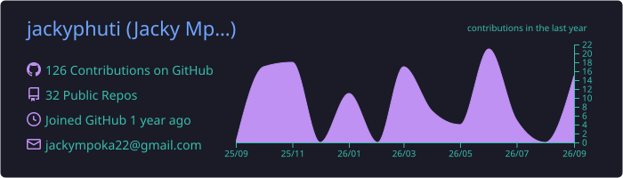
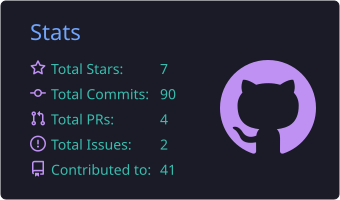
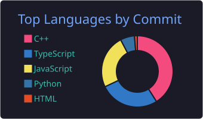
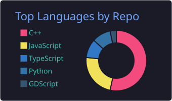
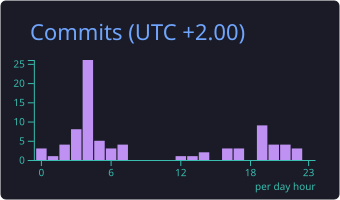

<!-- Banner -->

 

---

## 👋 About Me

I'm a **Software Development student** who loves working close to the machine and building things that ship.

- 🔭 **Interests:** Coding, Robotics, Operating Systems
- 🤝 **Looking to collaborate on:** Software Development, Data Science, Statistics, Web Development
- 🌱 **Always learning:** systems programming, AI/ML, and modern web tooling
- 📫 **Reach me:** via LinkedIn or email above

---

## 🧰 Tech Stack

| Area | Tools |
| :-- | :-- |
| **Languages** | Python · C++ · JavaScript |
| **Web** | HTML5 · CSS · Tailwind CSS |
| **Workflow** | Git · GitHub · Linux |

---

## 📊 GitHub Stats

---

Thanks for stopping by ⭐ — if something here interests you, let's talk.

